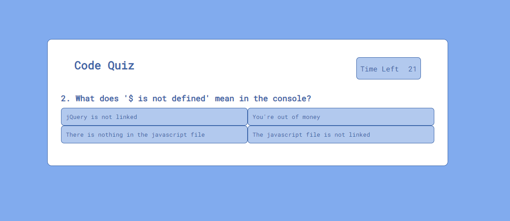

# Module 4 Challenge - Code Quiz

This week's challenge was to create a quiz with a working timer, start button scoring system, and a way to log
the user's highscores. The quiz and timer start when the Start button is pressed. Questions will flash either
red or green depending on if the correct answer is chosen or not. Once the time runs out or all the questions
have been answered, a prompt to record your initials will pop up. The info will then be stored into local storage.

Find the quiz <a href="https://pommerpie.github.io/codequiz/"> here! </a>
